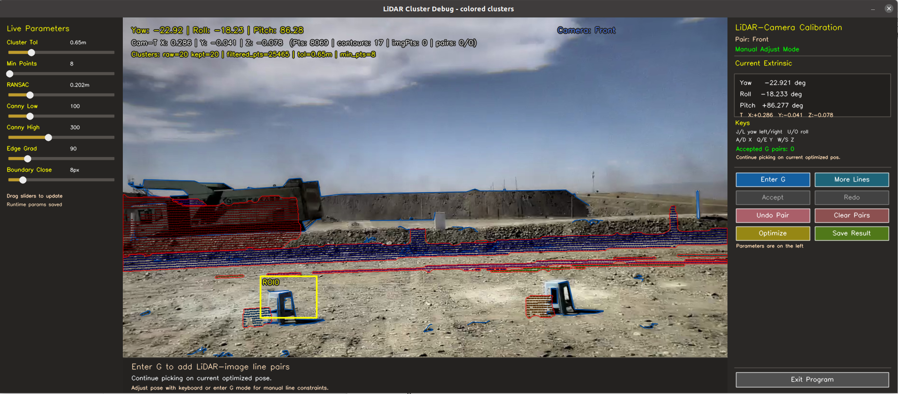
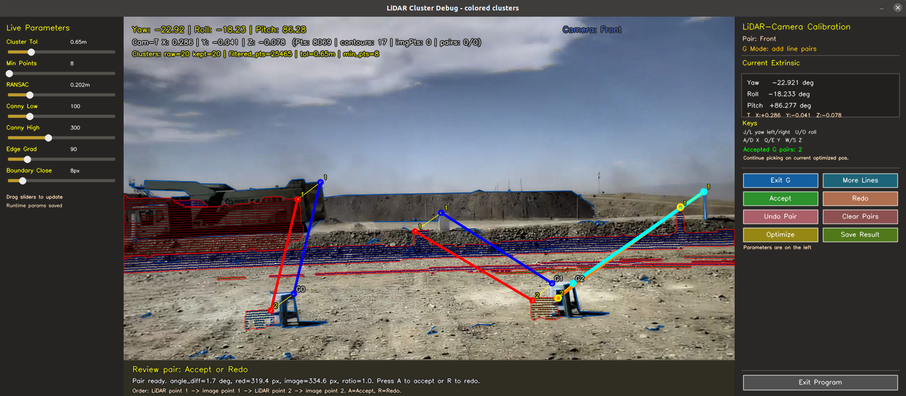
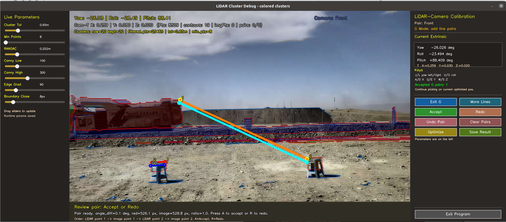
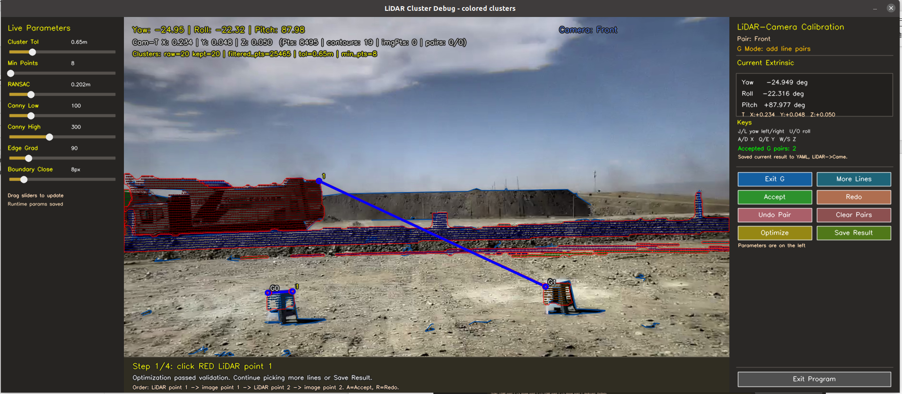

# Calibration Operation Guide#校准操作指南

A semi-automatic extrinsic calibration toolkit for LiDAR-camera systems.

This toolkit does not require a dedicated calibration board and supports LiDAR-camera extrinsic calibration directly in natural environments using geometric features from ordinary scene objects.该工具包不需要专用的校准板，并支持使用普通场景对象的几何特征直接在自然环境中进行lidar相机外部校准。


## 1. Calibration Scene and Target Placement# # 1。校准场景和目标放置

For reliable calibration, place clearly visible objects within the overlapping field of view of the LiDAR and camera.为了进行可靠的校准，请将清晰可见的物体放置在激光雷达和相机的重叠视场内。

Recommended practices:   建议做法:

- Prefer large targets with clear geometric edges.-偏好几何边缘清晰的大型目标。
- If no fixed structures are available, place three movable targets in each viewing direction and arrange them in a roughly triangular layout.—如果没有固定结构，在每个观察方向放置3个可移动目标，大致呈三角形布置。
- Suitable targets include plastic stools, bins, calibration boards, boxes, and other rigid objects with distinct corners.-适用的目标包括塑料凳、箱子、校准板、盒子和其他棱角明显的刚性物体。
- Larger targets are easier to observe in both images and point clouds.-在图像和点云中更容易观察到较大的目标。
- Small targets may produce too few returns on sparse BP LiDARs.-小目标在稀疏的BP激光雷达上可能产生太少的回报。
- Existing vehicles, retaining walls, and mounted calibration boards may also be used when they provide clear and repeatable edges.-当现有车辆、挡土墙和安装的校准板提供清晰和可重复的边缘时，也可以使用它们。
- Select targets at different image locations and, when possible, at different depths.-选择目标在不同的图像位置，如果可能的话，在不同的深度。

The objective is to identify corresponding LiDAR and image features that represent the same physical edges or corners.目标是识别代表相同物理边缘或角落的相应激光雷达和图像特征。

## 2. Start the Calibration Application# # 2。启动校准应用程序

Run the calibration application with the required sensor pair:使用所需的传感器对运行校准应用程序：

```bash 
./build/lidar_cam_semiauto_calibrator  
  --config config/calib_config.yaml/ 
  --pair Front  
```

Supported sensor pairs:   支持的传感器对：

| Pair | Description |   | Pair |描述|
| --- | --- |
| `Front` | Front telephoto camera and main LiDAR |
| `Fish` | Fisheye camera and main LiDAR |
| `Left` | Left camera and left BP LiDAR |
| `Right` | Right camera and right BP LiDAR |
| `Back` | Rear camera and rear BP LiDAR |

After startup, the application displays the camera image, projected LiDAR points and boundaries, live parameters, the current extrinsic estimate, and calibration controls.启动后，应用程序显示相机图像、投影激光雷达点和边界、实时参数、当前外部估计和校准控制。

！[校准主窗口]（docs/images/calibration_main_window.png）

## 3. Inspect Point-Cloud Preprocessing# # 3。检查点云预处理

Before selecting calibration features, inspect the ground removal and clustering results.在选择校准特征之前，检查地面去除和聚类结果。

The parameters in the left panel can be adjusted at runtime:左面板中的参数可以在运行时调整：

| Parameter | Description |   | |参数说明|
| --- | --- |
| `Cluster Tol` | Euclidean clustering distance threshold |
| `Min Points` | Minimum number of points required for a cluster |
| `RANSAC` | Ground-plane removal distance threshold |
| `Canny Low` | Lower Canny threshold for image-edge visualization |
| `Canny High` | Upper Canny threshold for image-edge visualization |
| `Edge Grad` | Minimum image-gradient magnitude |
| `Boundary Close` | Morphological closing size used for boundary construction |

In most cases, only the LiDAR preprocessing parameters need adjustment. The goal is to preserve the target points, suppress the ground, and obtain clear LiDAR boundaries or selectable LiDAR points.在大多数情况下，只需要调整LiDAR预处理参数。目标是保留目标点，抑制地面，并获得清晰的LiDAR边界或可选择的LiDAR点。

For sparse BP LiDARs, use a larger clustering tolerance and a smaller minimum cluster size than for the main AT128 LiDAR.对于稀疏BP激光雷达，使用比主AT128激光雷达更大的聚类容差和更小的最小聚类大小。

## 4. Coarsely Adjust the Extrinsic Parameters# # 4。粗调整外部参数

Check whether the projected LiDAR points appear near the corresponding objects in the image.检查投影的LiDAR点是否出现在图像中相应物体附近。

If the initial projection is significantly displaced, use the keyboard controls:如果初始投影明显偏移，请使用键盘控制：

| Key | Action |
| --- | --- |
| `J` / `L` | Adjust yaw |
| `I` / `K` | Adjust pitch |
| `U` / `O` | Adjust roll |
| `A` / `D` | Adjust X translation in the camera coordinate system |
| `Q` / `E` | Adjust Y translation in the camera coordinate system |
| `W` / `S` | Adjust Z translation in the camera coordinate system |

A precise manual alignment is not required. The LiDAR and image features only need to be close enough for reliable visual correspondence and point selection.

## 5. Enter G Mode and Add 3D-2D Line Correspondences

Press `G` or select **Enter G** to enter manual line-pairing mode.

For each line pair, select four points in the following order:

1. LiDAR point 1
2. Corresponding image point 1
3. LiDAR point 2
4. Corresponding image point 2

The two selected LiDAR points define a 3D line segment. The two selected image points define the corresponding 2D image line segment.

### Point snapping

- A selected LiDAR point is snapped to the nearest valid LiDAR boundary or projected LiDAR point.
- An image point may be snapped to a nearby corner or strong grayscale feature.
- If no suitable image feature is found, the original mouse position is used.

After selecting all four points, the application displays the LiDAR line, the image line, and their endpoint correspondence.



Review the pair before accepting it:



Select **Accept** or press `A` to add the current pair.

### Recommended feature selection

- Select multiple line pairs.
- Prefer clear physical edges and corners.
- Select lines with different orientations.
- Distribute selected features across different image regions.
- Use targets at different depths when possible.
- Avoid selecting all lines from one small image region.
- Ensure each LiDAR line and image line represent the same physical edge.
- Avoid shadow boundaries, moving objects, occlusions, and ambiguous geometry.

### Pair-management controls

| Control | Action |
| --- | --- |
| `Accept` or `A` | Accept the current pair |
| `Redo` or `R` | Discard and reselect the current pair |
| `Undo Pair` or `U` | Remove the most recently accepted pair |
| `Clear Pairs` or `X` | Remove all accepted pairs |
| `More Lines` | Continue adding line pairs |
| `G` | Enter or leave G mode |

## 6. Optimize the Extrinsic Parameters

After adding enough line correspondences, select **Optimize** or press `Enter`.

The optimizer refines the six-degree-of-freedom LiDAR-to-camera extrinsic transformation:

```text
[yaw, roll, pitch, x, y, z]
```

During optimization, verify that the projected LiDAR features move toward the corresponding image features.

A good result should improve the consistency of multiple selected targets simultaneously. Do not judge the result from only one line pair.



If the result is unsatisfactory:

- Check whether every line pair represents the same physical edge.
- Remove ambiguous or incorrectly ordered pairs.
- Add more non-parallel line pairs.
- Add features from different image regions or target depths.
- Improve the coarse initial extrinsic estimate.
- Recheck ground removal and clustering if target LiDAR points are missing.

> **Important:** Optimization updates only the current in-memory extrinsic estimate. It does not write result files automatically.

## 7. Save the Calibration Result

When the optimized projection is satisfactory, select **Save Result** or press `P`.

The application writes:

| File | Description |
| --- | --- |
| `result/extrinsic_result.toml` | LiDAR-to-camera extrinsic parameters |
| `result/extrinsic_result_camera_to_lidar.toml` | Camera-to-LiDAR extrinsic parameters |
| `config/calib_config.yaml` | Updated initial extrinsic parameters for future sessions |

After saving, exit the application and continue with the next camera-LiDAR pair.

## 8. Recommended Calibration Sequence

1. Place large targets with clear edges in the shared LiDAR-camera field of view.
2. Start the application with the correct `--pair`.
3. Inspect ground removal, clustering, and LiDAR projection.
4. Coarsely adjust the initial extrinsic parameters.
5. Enter G mode.
6. Select one 3D LiDAR line and its corresponding 2D image line.
7. Accept the pair.
8. Repeat for multiple non-parallel and spatially distributed line pairs.
9. Run optimization.
10. Inspect the projection on all selected targets.
11. Refine the selected pairs if necessary and optimize again.
12. Save the final result.
13. Verify the generated files under `result/` and the updated YAML configuration.

## 9. Troubleshooting

### The projected point cloud is completely outside the image

Check:

- The selected `--pair`
- Camera intrinsics
- Initial extrinsic parameters
- Image resolution and undistortion settings
- Whether the LiDAR point cloud belongs to the selected camera timestamp

### LiDAR points are difficult to select in G mode

Possible causes:

- The target is too small or too far away.
- The LiDAR returns are too sparse.
- Ground removal incorrectly removes target points.
- The clustering tolerance is too small.
- The minimum cluster size is too large.
- The initial extrinsic estimate is too far from the correct solution.

Use larger targets, adjust preprocessing parameters, or coarsely refine the extrinsic estimate before selecting lines.

### Image-point snapping selects an incorrect location

Adjust:

```yaml
manual_feature_pairing:
  image_corner_snap_enable: 1
  image_corner_snap_radius_px: 12
```

To disable automatic image-point snapping:

```yaml
manual_feature_pairing:
  image_corner_snap_enable: 0
```

### Optimization finishes but no result file is created

Select **Save Result** or press `P`. The **Optimize** action does not save files.
